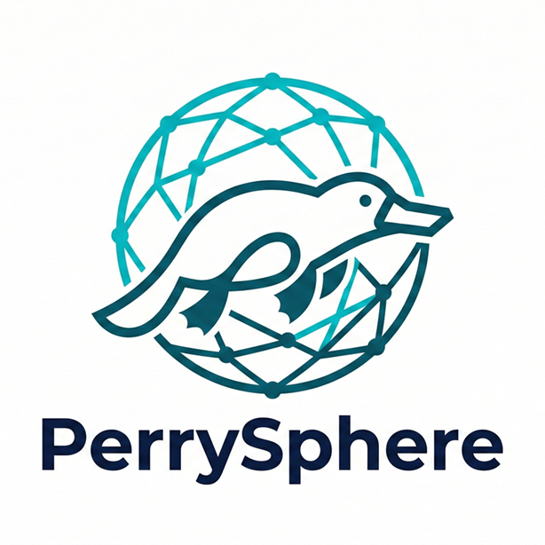
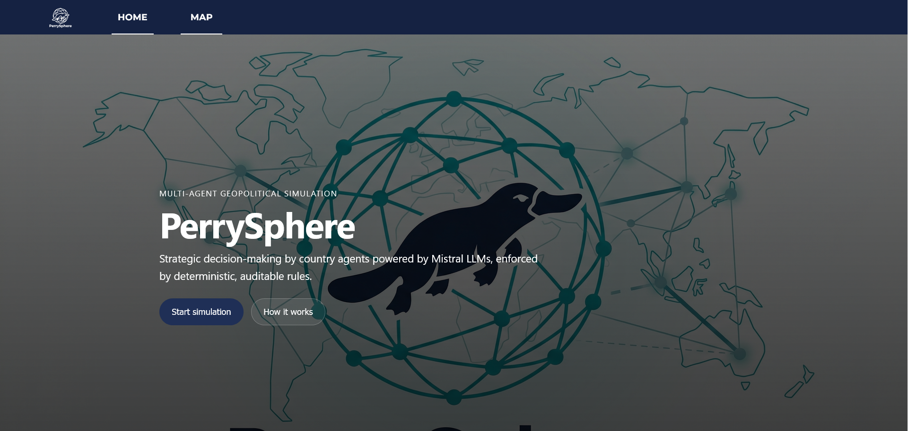
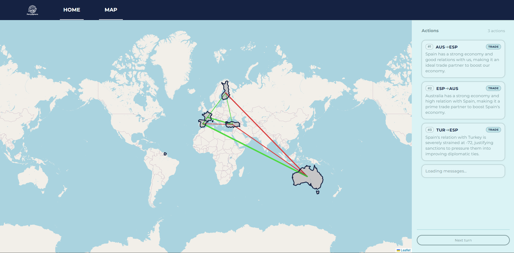
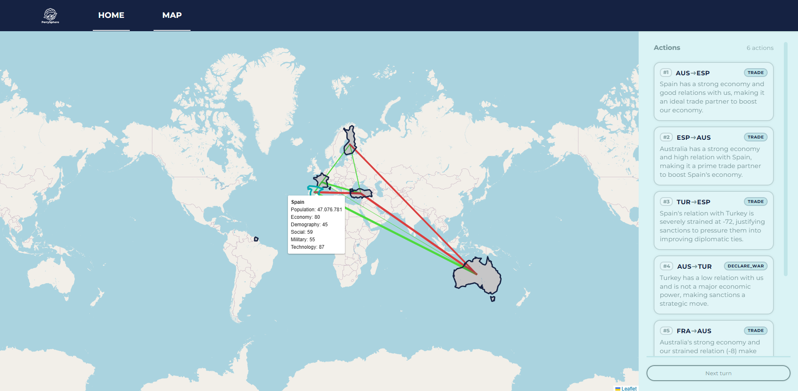

<p align="center">
  
</p>

# PerrySphere

This repository contains our project developed for the **Mistral Datathon (February 2026)**.

The goal of the project is to explore and prototype a **multi-agent geopolitical simulation powered by Large Language Models (LLMs)**, using Mistral models as the reasoning backbone.

The system models countries as autonomous agents capable of making strategic decisions (e.g., war declarations, alliances, trade, sanctions) within a structured world state. Actions have **quantitative effects** on inter-country relationships and internal metrics, enabling controlled simulation dynamics.


## Purpose

The main objectives of this project are:

* Design a **multi-agent architecture** driven by LLM-based decision-making.
* Define a structured **world state representation** with measurable metrics.
* Implement a **rule-based simulation engine** with quantitative effects.
* Build an interactive **React frontend with map visualization** to explore the simulation state in real time.
* Experiment with hybrid control:

  * LLM-driven strategic reasoning
  * Deterministic, auditable simulation rules
* Explore negotiation dynamics such as alliance proposals and responses.

The project emphasizes architectural clarity and modularity rather than production-ready deployment.


## High-Level Architecture

The system is organized into three layers:

1. **Frontend (React + Maps)**
   
   Visualizes the world state (countries, relations, events) and provides a UI to run turns / trigger actions.

3. **API Layer (FastAPI)**
   
   Bridges the frontend with the backend logic, exposing endpoints to:

   * fetch world state
   * step the simulation (turn-based loop)
   * return updated state for visualization

5. **Multi-LLM + Simulation Core**

   * **Multi-LLM layer**: country agents select structured actions using Mistral models
   * **Simulation engine**: applies deterministic rules and quantitative effects to update the world


## LLM Integration: mistral-small-2506

The cognitive core of our country agents is powered by the **`mistral-small-2506`** model via the **Mistral API**. 

In a multi-agent environment where every turn requires multiple complex evaluations, we selected this specific model for three main reasons:

* **Low latency and scalability:** Running a world simulation requires computing decisions for multiple countries per turn. `mistral-small-2506` provides the necessary speed to keep the simulation loop fluid without bottlenecks.

* **Reliable structured outputs:** Our simulation engine relies on strict deterministic rules. The model excels at strictly following our system prompts and reliably returning well-formatted JSON payloads (mapping perfectly to our `Action` and `ToolCall` **Pydantic schemas**) without hallucinating unsupported tools.

* **Nuanced strategic reasoning:** Despite being a small tier model, it proves highly capable of analyzing complex, multi-variable contexts (e.g., weighing military advantages against economic deficits or pending alliances) and generating coherent, context-aware justifications for its diplomatic actions.


## Installation

To start the project, you will need **Docker installed**. You must run both the backend and frontend containers in separate terminal windows.

Navigate to the **backend directory**, clean up any previous conflicting volumes and build the container:

```bash
cd Hackathon-Demo/back-end
docker compose down -v
docker compose up --build
```

Navigate to the **frontend directory**, clean up any previous conflicting volumes and build the container:

```bash
cd Hackathon-Demo/front-end
docker compose down -v
docker compose up --build
```

## Backend URL configuration

The frontend reads the backend base URL from .venv file:

```bash
VITE_PUBLIC_API_URL=http://localhost:8000
```

**Why this differs between environments**

* **WSL2 / Docker Desktop (Windows):**
  Containers run inside a VM. The browser cannot access Docker’s internal `172.x.x.x` network, so you must use the host-published port via `localhost`.

* **Native Linux Docker:**
  Docker runs natively and the bridge network is directly accessible. You can retrieve the backend container IP with:

```bash
docker inspect -f '{{range .NetworkSettings.Networks}}{{.IPAddress}}{{end}}' fastapi_backend
```

Then set:

```bash
VITE_PUBLIC_API_URL=http://<BACKEND_IP>:<backend_port>
```

Using `localhost` is generally more portable, but on native Linux accessing the container IP may also work.


## Access the Web Application

Once the frontend container finishes building and starts, you will see an output similar to this in your terminal:

```bash
react_frontend  |   VITE v7.3.1  ready in 307 ms
react_frontend  |
react_frontend  |   ➜  Local:   http://localhost:5173/
react_frontend  |   ➜  Network: http://172.23.0.2:5173/
```

To load the web application in your browser, choose the appropriate link based on your operating system (keeping in mind the **Backend URL configuration** explained in the previous section):

* **Windows (WSL2 / Docker Desktop):** Use the `Local` URL (`http://localhost:5173/`).

* **Native Linux:** You can use the `Network` URL (`http://172.23.0.2:5173/`) to access the container directly via the Docker bridge network.


## Application Navigation



Upon starting the frontend, you are greeted by the **Home** page, which serves as the main entry point for the application:

* **How it works:** Clicking this button navigates you to a detailed overview of the project, including its purpose, the architecture, simulation mechanics and the underlying game rules, among other information.

* **Start simulation:** This button takes you directly to the interactive map interface, where you can select your countries and begin the match.

* **Top Navbar:** You can also jump straight into the action at any time by clicking the **MAP** link in the top navigation bar.


## Simulation Mechanics & Game Rules

Once you navigate to the map and begin a session, the app operates as a turn-based, controlled environment. While the Mistral LLM drives the strategic reasoning, the simulation engine enforces strict deterministic rules to calculate the outcomes.


### 1. Game Setup
* **Selection:** The match begins by selecting **five countries** from the interactive map interface.

* **Initialization:** The simulation loads the initial `WorldState`, assigning starting internal metrics (e.g., economy, military power) and baseline bilateral relations to the selected countries.

### 2. Turn System
* **Progression:** The simulation advances manually when the user clicks the **"Next Turn"** button in the side panel.

* **Action selection:** During each turn, the active country agent evaluates the global context and selects a single structured action (or decides to pass). 

### 3. Actions & Consequences
* **Deterministic outcomes:** Once an action is chosen (e.g., `PROPOSE_ALLIANCE`, `SANCTION`, `DECLARE_WAR`, `TRADE`), the simulation engine applies predefined, quantitative effects.

* **Impact:** These actions dynamically alter both the internal statistics of the involved countries and their diplomatic relationships. These **changes are visually updated in real-time on the interactive map**, reflecting new diplomatic stances through relation lines and updating the values displayed inside each country's popup.

### 4. Bounded Constraints
* To maintain system stability and prevent numbers from scaling infinitely, all relationship scores are strictly bounded (e.g., from `-100` representing absolute hostility to `+100` for perfect alliances), and internal stats are clamped between `0` and `100`.

<br>






## Core Concepts

* **WorldState**: global representation of the simulation.

* **CountryState**: per-country metrics (economy, military power, technology, etc.).

* **RelationState**: bilateral relationship scores between countries.

* **ActionType**: structured action space (e.g., propose alliance, respond to alliance, war, sanction, trade, pass).

* **Quantitative Effects**: diplomatic actions translate into bounded numerical changes.


## Map Visualization

The interactive world map in the front-end is built using **Leaflet** and renders country polygons from a **GeoJSON** file. 

Please note the following technical decisions and limitations regarding the visualization:

* **Simplified geometry:** To ensure fast rendering and optimal performance in the browser, the chosen GeoJSON uses a reduced number of vertices. As a result, country borders are approximated and not perfectly exact.

* **Missing countries (ISO 3166-1 alpha-3):** You might notice that some countries or territories are not interactive on the map. This occurs due to data inconsistencies or missing mappings of the **ISO 3166-1 alpha-3** codes between the GeoJSON file properties and our simulation's database.


## Tech Stack

* React
* Python
* FastAPI
* Pydantic
* Asyncio

* Mistral LLM API
